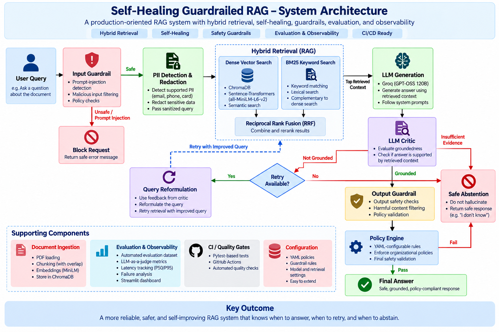

# Self-Healing Guardrailed RAG

A production-oriented Retrieval-Augmented Generation (RAG) system designed with hybrid retrieval, self-healing query reformulation, hallucination detection, safety guardrails, automated evaluation, CI quality gates, and an evaluation dashboard.

The project demonstrates how a basic RAG pipeline can be extended with reliability, safety, evaluation, and observability mechanisms required for production-oriented AI systems.

## Key Capabilities

- Hybrid retrieval using dense vector search and BM25 keyword search
- Reciprocal Rank Fusion (RRF) for combining retrieval results
- LangGraph-based self-healing workflow
- LLM critic for groundedness evaluation
- Automatic query reformulation and retrieval retry
- Safe abstention when sufficient document evidence is unavailable
- Prompt-injection input guardrails
- PII detection and redaction
- Output safety validation
- YAML-configurable policy engine
- Automated RAG evaluation dataset and LLM-as-a-judge evaluation
- Pytest-based quality gates
- GitHub Actions continuous integration
- Streamlit evaluation and observability dashboard
- P50/P95 latency tracking and failure analysis


## System Architecture

The system uses a LangGraph-based workflow that combines hybrid retrieval, self-healing query reformulation, hallucination detection, safety guardrails, policy enforcement, automated evaluation, and observability.




## Request Flow

1. The user query first passes through input safety checks.
2. Prompt-injection attempts can be blocked before retrieval.
3. Supported PII types are detected and redacted before downstream processing.
4. The sanitized query is sent to both dense vector search and BM25 keyword search.
5. Retrieval results are combined using Reciprocal Rank Fusion.
6. The LLM generates an answer using the retrieved document context.
7. A critic evaluates whether the generated answer is grounded in that context.
8. If the answer is not grounded, the system can reformulate the query and retry retrieval.
9. If sufficient evidence is unavailable, the system abstains instead of forcing an answer.
10. Grounded answers pass through output safety checks and the configurable policy engine before being returned.


## Tech Stack & Design Decisions

| Component | Technology | Why It Was Chosen |
|---|---|---|
| Workflow Orchestration | LangGraph | Supports stateful workflows, conditional routing, retry loops, and self-healing RAG logic. |
| LLM | GPT-OSS 120B via Groq | Provides hosted inference without requiring a large language model to run locally. |
| Embeddings | all-MiniLM-L6-v2 | Lightweight 384-dimensional embedding model suitable for semantic retrieval with modest local hardware requirements. |
| Vector Database | ChromaDB | Provides persistent local vector storage with metadata and similarity search. |
| Keyword Retrieval | BM25 | Complements semantic retrieval by matching important lexical terms and exact keywords. |
| Retrieval Fusion | Reciprocal Rank Fusion (RRF) | Combines dense and BM25 rankings without requiring their raw scores to be directly comparable. |
| PII Protection | Microsoft Presidio | Detects and anonymizes supported PII before downstream RAG processing. |
| Validation | Pydantic | Provides typed validation for application and evaluation data structures. |
| Configuration | YAML | Keeps policy rules configurable instead of hard-coding every rule into application logic. |
| Evaluation | Custom dataset + LLM-as-a-Judge | Measures expected behavior, grounding, relevance, retries, abstention, and latency. |
| Testing | Pytest | Provides automated tests for guardrails, policies, retrieval logic, and quality gates. |
| Continuous Integration | GitHub Actions | Automatically executes the test suite on pushes and pull requests to `main`. |
| Dashboard | Streamlit | Provides a lightweight interface for evaluation metrics, latency, guardrail performance, and failure analysis. |


### Why Hybrid Retrieval?

Dense retrieval is effective at finding semantically similar content, but it can miss exact terminology or domain-specific keywords.

BM25 performs strong lexical matching but does not understand semantic similarity.

The system therefore combines:

```text
Dense Vector Search
        +
BM25 Keyword Search
        ↓
Reciprocal Rank Fusion
        ↓
Top Retrieved Context
```

This provides complementary retrieval signals while avoiding direct comparison between BM25 scores and vector similarity scores.


## Self-Healing Strategy

A traditional RAG pipeline usually follows a linear flow:

```text
Query → Retrieve → Generate → Answer
```

If retrieval returns weak or irrelevant context, the LLM may still attempt to generate an answer.

This project introduces a critic-driven feedback loop so that an unsupported answer does not immediately reach the user.


### Self-Healing Flow

```text
Retrieve
   ↓
Generate
   ↓
Critic
   ↓
 ┌──────────────────────────────────────┐
 │                                      │
GROUNDED                         NOT_GROUNDED
 │                                      │
 ↓                                      ↓
Output Guardrail                  Query Reformulation
 │                                      │
 ↓                                      ↓
Policy Engine                     Retrieve Again
 │                                      │
 ↓                                      ↓
Final Answer                 Generate → Critic Again

ABSTAINED
   ↓
Safe Fallback
```


### Critic

After generation, a separate critic call evaluates whether the answer is supported by the retrieved context.

The critic can produce three routing outcomes:

- **GROUNDED** — the answer is supported by the retrieved evidence and can continue through downstream safety and policy checks.
- **NOT_GROUNDED** — the answer is not sufficiently supported, so the system can attempt self-healing.
- **ABSTAINED** — the available context is insufficient to answer reliably, so the workflow routes to a safe fallback.


### Query Reformulation

When the critic returns `NOT_GROUNDED`, the system uses the original sanitized question, critic feedback, and previously retrieved context to create an improved retrieval query.

The improved query is then sent back through hybrid retrieval:

```text
Critic Feedback
      ↓
Query Reformulation
      ↓
Hybrid Retrieval
      ↓
Generate
      ↓
Critic
```

This allows the system to recover from some retrieval failures instead of immediately returning an unsupported answer.


### Controlled Retry

Retries are intentionally bounded.

An unlimited self-healing loop could:

- increase API usage,
- significantly increase latency,
- repeatedly retrieve similar context,
- and potentially never converge on a grounded answer.

The workflow therefore uses a controlled retry policy.

If the system still cannot obtain sufficient evidence, it falls back instead of continuing indefinitely.


### Safe Abstention

When the document context does not contain enough evidence, the system returns a safe fallback rather than forcing an answer.

> **Knowing when not to answer is part of answer quality.**


### Trade-off: Reliability vs Latency

Self-healing improves reliability, but additional retrieval, generation, reformulation, and critic calls increase latency.

The evaluation dashboard therefore tracks both quality and performance metrics, including:

- retry rate
- retry vs. no-retry latency
- P50 latency
- P95 latency
- grounding failures
- abstention behavior

This makes the reliability-versus-latency trade-off measurable rather than treating retries as free.


## Evaluation Results

The system was evaluated using a curated **20-case evaluation dataset** covering answer generation, compound questions, abstention, prompt injection, and PII-redaction scenarios.

| Metric | Result |
|---|---:|
| Evaluation Cases | 20 |
| Execution Success Rate | 100% |
| Behavior Accuracy | 100% |
| Overall Grounded Rate | 95% |
| Answer Grounded Rate | 90.91% |
| Abstention Accuracy | 100% |
| Prompt Injection Block Rate | 100% on 4 current test cases |
| PII Redaction Expected-Behavior Success | 100% on 3 current test cases |
| Retry Rate | 45% |
| Average Retries per Query | 0.45 |
| Non-Blocked Latency P50 | 35.95 s |
| Non-Blocked Latency P95 | ~62.13 s |


### What the Results Show

The system achieved correct expected behavior across all 20 evaluation cases.

Among the 11 cases where the system was expected to produce an answer, 10 were judged grounded, resulting in an **answer-grounded rate of 90.91%**.

One evaluation case (`q07`) produced a relevant and behaviorally correct partial answer but failed the external grounding evaluation.

This failure is intentionally retained in the evaluation baseline and surfaced in the dashboard rather than being hidden.

The evaluation also shows an important performance trade-off: **45% of evaluation cases required a retry**.

Self-healing can improve recovery from weak retrieval or unsupported generation, but additional retrieval and LLM calls increase latency.


### Evaluation Method

Each evaluation case defines an expected system behavior such as:

- answer
- partial answer
- abstain
- block unsafe input
- answer after PII redaction

The RAG workflow is executed against each case and the resulting behavior, grounding, relevance, retry count, and latency are recorded.

A separate LLM-as-a-judge call evaluates answer-quality dimensions such as behavioral correctness, grounding, and relevance.

> The judge currently uses the same model/provider family as the application workflow, so the evaluation should be interpreted as an automated quality signal rather than a fully independent external benchmark.


### Evaluation Limitations

The current 20-case dataset is intentionally small and serves as a portfolio-scale regression suite rather than a comprehensive production benchmark.

Prompt-injection results currently cover four explicit attack cases, so the reported 100% block rate should not be interpreted as universal prompt-injection protection.

Similarly, the PII metric measures successful expected behavior on the current redaction cases; it does not represent a complete precision/recall benchmark of the underlying PII detector.


## Automated Testing & Continuous Integration

The project includes an automated test suite and GitHub Actions workflow to detect regressions before changes are merged or deployed.


### Test Coverage

The current suite contains **16 automated tests** covering:

| Area | What Is Tested |
|---|---|
| Input Guardrails | Normal input acceptance, prompt-injection blocking, email redaction, and phone-number redaction |
| Policy Engine | Citation requirements, blocked competitor terms, and configured blocked topics |
| Retrieval Logic | Query decomposition, Reciprocal Rank Fusion output structure, and duplicate-document fusion |
| Quality Gates | Execution success, behavior accuracy, answer grounding, and latency-regression threshold framework |

Run the complete test suite locally with:

```bash
pytest tests -v
```

Current tested checkpoint:

```text
16 passed
```


### GitHub Actions CI

The repository includes a GitHub Actions workflow that automatically runs the test suite on:

- pushes to `main`
- pull requests targeting `main`

The CI pipeline performs:

```text
Checkout Repository
        ↓
Set Up Python 3.12
        ↓
Install Dependencies
        ↓
Install spaCy Language Model
        ↓
Run Pytest Test Suite
        ↓
Pass / Fail
```

This provides an automated regression checkpoint before deployment.


### Evaluation Quality Gates

The test suite validates the committed evaluation baseline against minimum quality thresholds.

Current thresholds include:

- execution success rate >= 95%
- behavior accuracy >= 85%
- answer-grounded rate >= 85%

A latency-regression threshold of **20%** is also represented in the quality-gate configuration.

> The current latency test establishes the regression-gate framework against the approved baseline. It does not yet execute a fresh end-to-end evaluation inside CI, so it should not be interpreted as real-time latency regression detection.


### CI-Safe Test Design

Heavy production resources such as the local ChromaDB corpus, embedding model, BM25 index, source PDF, and Groq API calls are not required by the core CI unit tests.

Retrieval tests use synthetic inputs to validate decomposition and RRF behavior without loading the complete RAG stack.

This keeps the CI pipeline reproducible and avoids requiring:

- private API keys for unit tests
- local vector databases
- source documents
- large embedding-model downloads during retrieval tests

The full RAG evaluation remains a separate evaluation workflow because it requires the actual corpus, retrieval indexes, and LLM inference.


## Dashboard & Live Demo

A Streamlit evaluation dashboard is deployed publicly to visualize the quality, reliability, safety, and latency characteristics of the RAG system.


### Live Dashboard

[Open the Live Evaluation Dashboard](https://self-healing-guardrailed-rag-qrph6mdusfcz8zwdhviejf.streamlit.app/)


### Dashboard Features

The dashboard provides visibility into:

- execution success rate
- behavior accuracy
- overall grounded rate
- answer-grounded rate
- retry rate
- abstention accuracy
- P50 and P95 latency
- retry vs. no-retry latency
- per-evaluation-case latency
- prompt-injection block rate
- PII-redaction expected-behavior success
- individual evaluation failures
- failure-category distribution


### Current Deployment Scope

The deployed Streamlit application is an **evaluation and observability dashboard** backed by the approved evaluation baseline.

It does not execute the complete RAG pipeline or call the Groq API when the dashboard loads.

Instead, it visualizes committed evaluation results generated from the full RAG workflow.

This keeps the public dashboard:

- lightweight
- reproducible
- independent of API quotas
- fast to start

The complete RAG implementation, including hybrid retrieval, generation, critic evaluation, query reformulation, guardrails, and policy enforcement, is maintained in this repository.


## Project Structure

```text
self-healing-rag/
│
├── .github/
│   └── workflows/
│       └── ci.yml
│
├── benchmarks/
│   ├── baseline_rag.py
│   ├── chunking_benchmarks.py
│   ├── critic_benchmark.py
│   └── embedding_benchmark.py
│
├── dashboard/
│   ├── app.py
│   └── requirements.txt
│
├── data/
│   ├── chroma/
│   ├── documents/
│   └── bm25_index.pkl
│
├── docs/
│   └── architecture.png
│
├── eval/
│   ├── eval_dataset.json
│   ├── baseline_results.json
│   ├── baseline_metrics.json
│   ├── judge.py
│   ├── metrics.py
│   └── run_eval.py
│
├── src/
│   ├── bm25.py
│   ├── chroma_store.py
│   ├── chunking.py
│   ├── guardrails.py
│   ├── ingestion.py
│   ├── policy_engine.py
│   ├── retrieval.py
│   └── self_healing_rag.py
│
├── tests/
│   ├── test_input_guardrails.py
│   ├── test_policy_engine.py
│   ├── test_quality_gates.py
│   └── test_retrieval.py
│
├── policy.yaml
├── requirements.txt
└── README.md
```


### Directory Responsibilities

- **`src/`** — Core RAG implementation including ingestion, hybrid retrieval, LangGraph workflow, guardrails, and policy enforcement.
- **`eval/`** — Evaluation dataset, LLM-as-a-judge logic, benchmark execution, approved baseline results, and metrics.
- **`tests/`** — Automated unit, guardrail, policy, retrieval-logic, and quality-gate tests.
- **`benchmarks/`** — Experiments used to evaluate baseline RAG behavior, embedding configuration, chunking, and critic behavior.
- **`dashboard/`** — Streamlit evaluation and observability dashboard.
- **`.github/workflows/`** — GitHub Actions continuous-integration configuration.
- **`docs/`** — Architecture and documentation assets.
- **`data/`** — Local source documents and generated retrieval indexes. Large/local runtime artifacts are excluded from Git where appropriate.


## Local Setup

### 1. Clone the Repository

```bash
git clone https://github.com/kdkarthika2220-source/self-healing-guardrailed-rag.git
cd self-healing-guardrailed-rag
```


### 2. Create a Virtual Environment

Windows:

```powershell
py -m venv .venv
.venv\Scripts\Activate.ps1
```


### 3. Install Dependencies

```powershell
python -m pip install --upgrade pip
pip install -r requirements.txt
```


### 4. Install the spaCy Language Model

```powershell
python -m spacy download en_core_web_sm
```


### 5. Configure the Groq API Key

For the current PowerShell session:

```powershell
$env:GROQ_API_KEY="YOUR_GROQ_API_KEY"
```

> Never commit API keys or secrets to the repository.


### 6. Prepare the Source Document

The source PDF is intentionally excluded from the public repository.

Place the required source document at:

```text
data/documents/digital_health_handbook.pdf
```


### 7. Build the Retrieval Indexes

The project uses both ChromaDB and BM25 indexes.

Build the vector store first, followed by the BM25 index using the project's ingestion/indexing scripts.

Generated indexes are stored locally and are intentionally excluded from Git.


### 8. Run the Test Suite

```powershell
pytest tests -v
```


### 9. Run the Evaluation Dashboard

```powershell
streamlit run dashboard/app.py
```

The dashboard uses the committed evaluation baseline and therefore does not require a live Groq API call to render.


## Known Limitations

This project intentionally exposes current limitations rather than presenting the system as fully production-complete.

- The evaluation dataset currently contains 20 curated cases and should be expanded for broader coverage.
- Prompt-injection protection currently relies on a limited rule-based pattern set and requires adversarial/paraphrased attack evaluation.
- The PII evaluation set is small and does not provide full detector precision/recall measurements.
- The LLM-as-a-judge uses the same model/provider family as the application workflow and is therefore not fully independent.
- Citation policy enforcement currently validates citation syntax rather than verifying that every citation semantically supports the associated claim.
- Query decomposition is intentionally simple and may not optimally decompose complex questions.
- BM25 currently uses a simple tokenizer and could be improved with stronger normalization/tokenization.
- Self-healing retries improve recovery but can significantly increase tail latency.
- Current P95 latency remains high for a production interactive application and requires further optimization.
- The CI retrieval tests validate retrieval logic using synthetic inputs rather than running against the complete local corpus.
- The latency quality gate currently provides a regression-threshold framework but does not execute a fresh end-to-end latency benchmark during every CI run.
- The public Streamlit deployment visualizes evaluation results; it is not currently a hosted interactive RAG service.


## Future Improvements

Planned improvements include:

- expand the evaluation dataset with paraphrased, adversarial, and edge-case queries
- introduce stronger prompt-injection detection
- benchmark PII detection using precision, recall, and F1
- add citation-to-source semantic verification
- improve BM25 tokenization and retrieval preprocessing
- evaluate reranking models after hybrid retrieval
- add retrieval confidence signals
- improve query decomposition for compound questions
- reduce retry-related latency through more selective self-healing
- introduce stage-level latency tracing for retrieval, generation, critic, and reformulation
- add API retry/backoff and operational failure classification
- run scheduled full-corpus evaluation outside lightweight CI
- compare evaluation judgments using an independent judge model/provider
- deploy an optional interactive RAG demo separately from the evaluation dashboard


## Engineering Takeaways

This project demonstrates that building a reliable RAG system requires more than connecting a vector database to an LLM.

The implementation focuses on four engineering concerns:

1. **Retrieval Quality** — combining semantic and lexical retrieval using hybrid search and RRF.
2. **Reliability** — detecting unsupported generations and attempting controlled self-healing.
3. **Safety** — applying input guardrails, PII redaction, output checks, policy enforcement, and safe abstention.
4. **Evaluation & Observability** — measuring grounding, behavior, retries, latency, failures, and enforcing regression checks through CI.